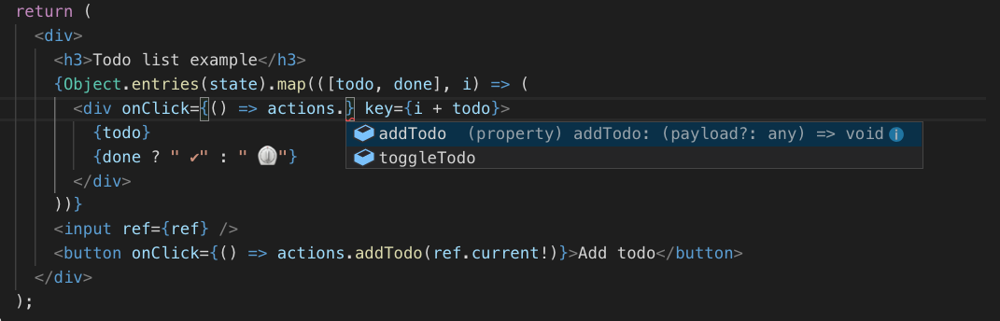

# global-hook-store


Dead simple global store using hooks for react.

## [Demo](https://richarddd.github.io/global-hook-store)

## TL&#59;DR

Counter: https://codesandbox.io/s/j2v0p6kq7w

Todo list: https://codesandbox.io/s/54kwqpppnx

## Installation

    // yarn
    yarn add global-hook-store

    // npm
    npm -i global-hook-store --save

## Usage

Its super super simple to use. Only three steps required.

1. Create your store with initial state & reducer style functions 👇

```javascript
const counterStore = createStore(
  {
    count: 0,
  },
  {
    increment: ({ count }) => ({ count: count + 1 }),
    decrement: ({ count }) => ({ count: count - 1 }),
  }
);
```

2. Use store 👌

```javascript
const App = () => {
  const { actions, state } = useStore(counterStore);

  return (
    <>
      <h1>Count {state.count}</h1>
      <button onClick={() => actions.decrement()}>-</button>
      <button onClick={() => actions.increment()}>+</button>
    </>
  );
};
```

3. Profit 🎉

_The reducer style functions are converted to actions which could be called from react_

## Example with payload

Todo list:

```javascript


const todoStore = createStore({} as Todo, {
  // payload is here:  👇
  toggleTodo: (todos, todo:string) => {
    todos[todo] = !todos[todo];
    return { ...todos };
  },
  // payload is here:👇
  addTodo: (todos, input:HTMLInputElement) => {
    const todo = input.value;
    input.value = "";
    return { ...todos, [todo]: false };
  }
});

```

```javascript
const ToDoList = () => {
  const { state, actions } = useStore(todoStore);
  const ref = useRef(null);

  return (
    <div>
      <h3>Todo list example</h3>
      {Object.entries(state).map(([todo, done], i) => (
        // passed payload:                      👇
        <div onClick={() => actions.toggleTodo(todo)} key={i + todo}>
          {todo}
          {done ? " ✔" : " ⏲"}
        </div>
      ))}
      <input ref={ref} />
      <button onClick={() => actions.addTodo(ref.current!)}>Add todo</button>
    </div>
  );
};
```

## Nice to have

### Typescript support

When using typescript actions, state and payload types are infered:


If you dont need any payload, simply don't specify it in the reducer or set the payload type as `null` or `undefined` and the mapped actions could be executed like this:

```javascript
const fooBarStore = createStore(
  {
    fooBar: 0
  },
  {
    setFooBar: (_state, payload:number) => ({ fooBar: payload }),
    incrementFooBar: ({fooBar}) => ({ fooBar: fooBar + 1 })
    decrementFooBar: ({fooBar},payload:null) => ({ fooBar: fooBar - 1 })
  }
)
```

```javascript
fooBarStore.actions.setFooBar(10);
fooBarStore.actions.incrementFooBar();
fooBarStore.actions.decrementFooBar();

fooBarStore.actions.setFooBar(); // error, because we are missing required payload
```

### Async actions work out of the box:

```javascript
const counterStore = createStore(
  {
    count: 0,
  },
  {
    increment: ({ count }) => ({ count: count + 1 }),
    decrement: ({ count }) => ({ count: count - 1 }),
    incrementByTen: async ({ count }) => {
      const promise = new Promise((resolve) => setTimeout(resolve, 3000));
      await promise;
      return { count: count + 10 };
    },
  }
);
```

Also use this handy util for automatically setting loading, error and data state:

```javascript
const githubStore = createStore(
  {
    // async initialicer:👇 (will create a typed object like this { loading: false, data: [], error: undefined})
    repos: asyncState<Repo[]>([]),
    userId: ""
  },
  {
    setRepoId: (state, userId: string) => ({ ...state, userId }),
      // util function:                              👇
    getUserRepos: async ({ userId }, _payload, { asyncAction }) =>
      asyncAction("repos", githubApi.getRepo(userId))
  }
);
```

### State receiver when using async actions

If you are modiyfing state within an async action you have to take state changes which may occur during your async action into consideration.

Consider the following store. If the `incrementByTen` action is called 3 times in less than one second (the time it takes to complete), the `count` will still be `10`. Why? Because the moment when you call the action it will return the original states `count` which is 0 for each of those times. This is sometimes a common misstake, but its very simple to avoid.

```javascript
const counterStore = createStore(
  {
    count: 0,
  },
  {
    increment: ({ count }) => ({ count: count + 1 }),
    incrementByTen: async ({ count }) => {
      await delay(1000);
      return { count: count + 10 };
    },
  }
);

//inside component:
for (let i = 0; i < 3; i++) {
  incrementByTen();
}
```

**Solution:**

You could use a "state receiver" from `utils`. The state receiver always returns the current state when called:

```javascript
const store = createStore(
  {
    count: 0,
  },
  {
    increment: ({ count }) => ({ count: count + 1 }),

    incrementByTenReceived: async (_state, _payload, { receiveState }) => {
      await delay(1000);
      return { count: receiveState().count + 10 };
    },
  }
);
```

OR you can always await the state change by awaiting the action:

```javascript
for (let i = 0; i < 3; i++) {
  await incrementByTen();
}
```

### Getters and setters are preserved:

```javascript
const nameAndCounterStore = createStore(
  {
    count: 0,
    name: "Willy wonka",
    get length() {
      return this.name.length;
    },
  },
  {
    increment: ({ count, ...state }) => ({ ...state, count: count + 1 }),
    decrement: ({ count, ...state }) => ({ ...state, count: count - 1 }),
    updateName: (state, name) => ({ ...state, name }),
  }
);
```

```javascript
const {
  state: { length },
  actions,
} = useStore(nameAndCounterStore);
```

```
<span>{length}</span>
```

### Use the same style local store also

```javascript
const App = () => {
  const { actions, state } = useLocalStore(counterStore);

  return (
    <>
      <h1>Count {state.count}</h1>
      <button onClick={() => actions.decrement()}>-</button>
      <button onClick={() => actions.increment()}>+</button>
    </>
  );
};
```

### Reset util

Use this util to reset the entire state to initial state or just a part of the state

```javascript
const githubStore = createStore(
  {
    repos: asyncState<Repo[]>([]),
    userId: ""
  },
  {
    resetAll: (_state, _payload: null, { reset }) => reset(),
    resetRepos: (_state, _payload: null, { reset }) => reset("repos") // also typed
  }
);

```

Also available as a reset hook when componet unmounts. This is very practical for when having a "current" item present in the store. If you have a `userStore` for instance you might want the `currentUser` to be cleared when the user-details component is unmounted. `useStoreReset` will reset the stores key to its initial state when component is unmounted

```javascript
useStoreReset(userStore, "currentUser");
```

```javascript
useStoreReset(store, "stateKey1","stateKey2", "stateKey3"...)
```
